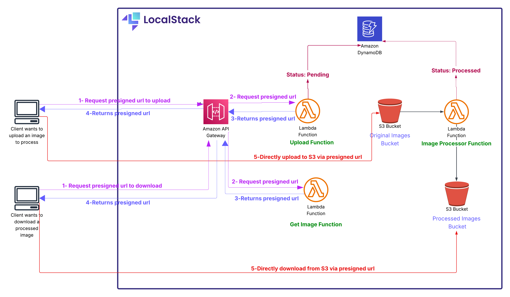
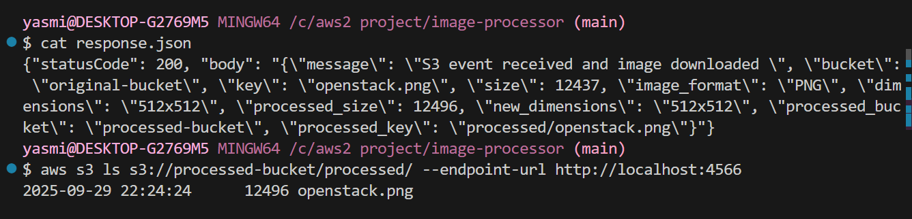
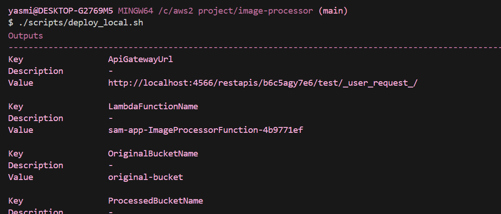
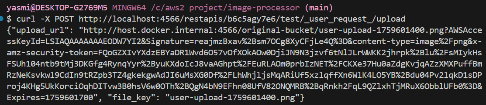
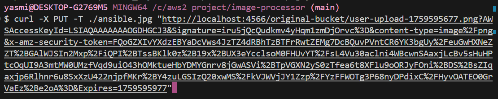
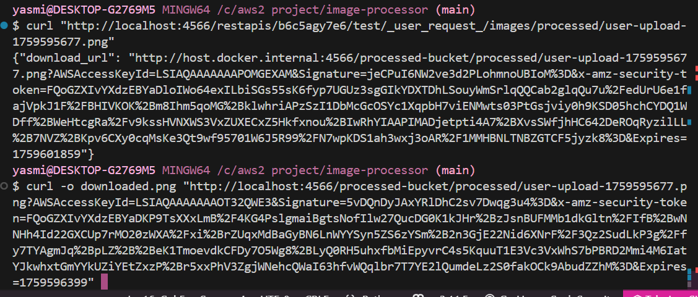
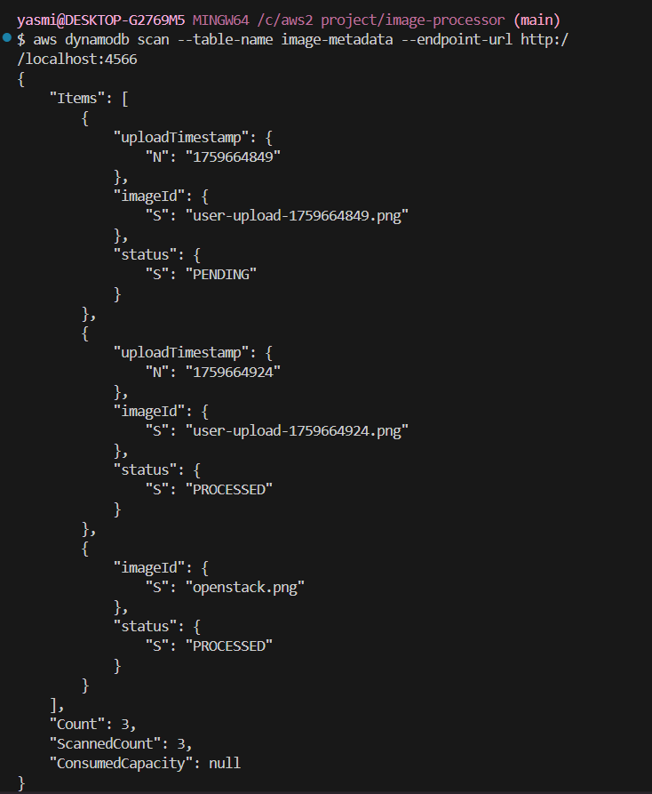

#   Project Preview


This project simulates a serverless image processing pipeline using AWS cloud services, deployed entirely in a local environment with LocalStack.

The goal is to reproduce how a real-world AWS-based image processing system works from uploading an image, to processing it automatically through Lambda, and storing metadata in DynamoDB.

The system consists of three main functionalities:

* Uploading images using a pre-signed URL generated by an API Gateway + Lambda to an S3 bucket.

* Processing uploaded images automatically through a Lambda triggered by S3 upload events.

* Providing a pre-signed download link for clients to retrieve the processed image from another S3 bucket.

## Table of Contents
- [Architecture Overview](#architecture-overview)
  - [Architecture Diagram](#architecture-diagram)
- [Services Used](#services-used)
  - [Amazon S3](#amazon-s3)
  - [AWS Lambda](#aws-lambda)
  - [Amazon DynamoDB](#amazon-dynamodb)
  - [Amazon API Gateway](#amazon-api-gateway)
  - [AWS CloudFormation / AWS SAM](#aws-cloudformation--aws-sam)
- [Prerequisites](#prerequisites)
- [Project Strcuture](#project-structure)
- [Local Deployment and Testing Workflow](#local-deployment-and-testing-workflow)
  - [1. Deploying the Infrastructure Locally](#1-deploying-the-infrastructure-locally)
  - [2. Verifying Lambda Deployment and Configuration](#2-verifying-lambda-deployment-and-configuration)
  - [3. Invoking the Lambda Function Manually](#3-invoking-the-lambda-function-manually)
  - [4. Testing the API Gateway](#4-testing-the-api-gateway)
  - [5. Verifying DynamoDB Storage](#5-verifying-dynamodb-storage)
- [Conclusion](#conclusion)

# Architecture Overview
The architecture is designed following a typical event-driven serverless pattern:

* The client first requests a pre-signed upload URL from the Upload Lambda.

* The client then uses that URL to upload an image directly to the Original Images S3 bucket.

* Once uploaded, an S3 event notification automatically triggers the Image Processor Lambda.

* The processor downloads the image, resizes it using Pillow, uploads the processed version to a Processed Images S3 bucket, and updates the DynamoDB table to mark it as PROCESSED.

* When the client wants to retrieve the processed image, they call the Download Lambda, which generates a pre-signed GET URL to access the file securely.

## Architecture Diagram 


# Services Used
## Amazon S3
Two S3 buckets are used:
* original-bucket: stores raw images uploaded by users.
* processed-bucket: stores resized images generated by the processor Lambda.
S3 also serves as the trigger source for the processor Lambda function when new images are uploaded.

## AWS Lambda
Three Lambda functions form the core logic of this project:

1. Upload Function (upload_app.py)
Generates a pre-signed upload URL that allows the client to upload images directly to the S3 bucket without exposing AWS credentials.

2. Processor Function (app.py)
* Triggered automatically when an image is uploaded to original-bucket.
* It downloads the image, resizes it (max 800x800), and uploads it to processed-bucket.
* Finally, it updates DynamoDB with the new image status (PROCESSED).

3. Download Function (download_app.py)
Generates a pre-signed download URL for clients to securely retrieve the processed image.

## Amazon DynamoDB
Used to store and track the metadata of each image:
* imageId: unique key (image filename)
* uploadTimestamp: upload time (for tracking)
* status: current state (PENDING or PROCESSED)
DynamoDB ensures visibility into which images have been successfully processed.

## Amazon API Gateway
Serves as the entry point for the client to interact with the system.
It exposes two endpoints:
* /upload → invokes Upload Lambda
* /download → invokes Download Lambda

## AWS CloudFormation / AWS SAM

The infrastructure is defined as code using a SAM template (template.yaml), which abstracts and simplifies the underlying CloudFormation syntax.
While CloudFormation provides the foundation for defining AWS resources as code, it can be verbose and complex to manage for serverless applications. AWS SAM (Serverless Application Model) extends CloudFormation with a more concise and developer-friendly syntax tailored for Lambda-based architectures.
This template describes:
* The S3 buckets
* The DynamoDB table
* The Lambda functions
* The API Gateway configuration
* The permissions and event triggers

All resources are deployed and configured automatically through this template.
# Prerequisites
Before running this project, ensure you have the following installed and configured:

| Tool | Version | Purpose |
|------|---------|---------|
| **Docker** | v20.10+ | Running LocalStack containers |
| **AWS SAM CLI** | v1.100+ | Building and deploying serverless applications |
| **Python** | 3.11 | Lambda runtime environment |
| **AWS CLI** | v2.x | Interacting with LocalStack services |
| **LocalStack** | Latest | Local AWS cloud emulation |

# Project Structure
| File | Purpose |
|------|---------|
| `template.yaml` | Infrastructure as Code - defines all AWS resources (S3, Lambda, DynamoDB, API Gateway) |
| `image_processor/app.py` | Image Processor Lambda - resizes images and updates DynamoDB status |
| `images_processor/upload_app.py` | Generates pre-signed URLs for secure S3 uploads without exposing credentials |
| `images_processor/get_app.py` | Generates pre-signed URLs for secure S3 downloads |
| `images_processor/requirements.txt` | Python dependencies (Pillow for image processing, boto3 for AWS SDK) |
| `scripts/deploy_local.sh` | Automates the LocalStack deployment process |
| `events/event2.json` | Sample S3 event payload for manual Lambda testing |

---
# Local Deployment and Testing Workflow
Since this project uses LocalStack, all AWS services run locally in Docker containers, allowing complete testing without an AWS account.

1. Deploying the Infrastructure Locally 

All resources (S3 buckets, DynamoDB table, Lambda functions, and API Gateway) are deployed locally using the scripts/deploy_local.sh.
This script:
* Configures AWS CLI to point to LocalStack
* Creates mock S3 buckets for uploads and processed images
* Builds and deploys the SAM stack locally

2. Verifying Lambda Deployment and Configuration 

After deployment, you can use the AWS CLI (with LocalStack endpoint) to ensure your Lambda functions are correctly deployed:
``` bash 
aws lambda list-functions --endpoint-url http://localhost:4566
``` 
=> Lists all deployed Lambda functions.
``` bash 
aws lambda get-function-configuration \
  --function-name sam-app-ImageProcessorFunction-d4b5d069 \
  --endpoint-url http://localhost:4566
```

=> Displays the configuration of a specific function.
Initially, the environment variable AWS_ENDPOINT_URL may be missing, so it can be added using:
``` bash 
aws lambda update-function-configuration \
  --function-name sam-app-ImageProcessorFunction-d4b5d069 \
  --environment "Variables={AWS_ENDPOINT_URL=http://host.docker.internal:4566}" \
  --endpoint-url http://localhost:4566
```
3. Invoking the Lambda Function Manually

You can test the function by invoking it directly and saving the response:
``` bash 
aws lambda invoke \
  --function-name sam-app-ImageProcessorFunction-d4b5d069 \
  --payload fileb://events/event2.json \
  --endpoint-url http://localhost:4566 \
  response.json
``` 
``` bash 
cat response.json
``` 

To verify that the processed image has been generated:
```bash 
aws s3 ls s3://processed-bucket/processed/ --endpoint-url http://localhost:4566
```


4. Testing the API Gateway 

Once the API Gateway is deployed, its endpoint is shown in the SAM deployment output.


To test the upload and retrieval process:
* Generate a pre-signed upload URL:
```bash 
curl -X POST http://localhost:4566/restapis/<api_id>/test/_user_request_/upload
```


* Upload an image using the returned URL:
```bash 
curl -X PUT -T ./image.jpg "your_presigned_url"
```


* Retrieve the processed image:
```bash 
curl "http://localhost:4566/restapis/<api_id>/test/_user_request_/images/processed/user-upload-1759595677.png"
```
* Or download it directly:
```bash 
curl -o downloaded.png "your_presigned_url"
``` 


5. Verifying DynamoDB Storage

To confirm that the Lambda correctly stores metadata in DynamoDB:
```bash 
aws dynamodb scan --table-name image-metadata --endpoint-url http://localhost:4566
```


# Conclusion

This project demonstrates how to build and simulate a complete serverless image processing pipeline using AWS services locally through LocalStack. 

It simulates a cloud setup with event-driven Lambda functions, S3 storage, API Gateway integration, and DynamoDB tracking , all without needing an active AWS account.

This setup provides a foundation for experimenting with and extending real-world AWS architectures locally, which can be later deployed seamlessly to the actual AWS cloud.


